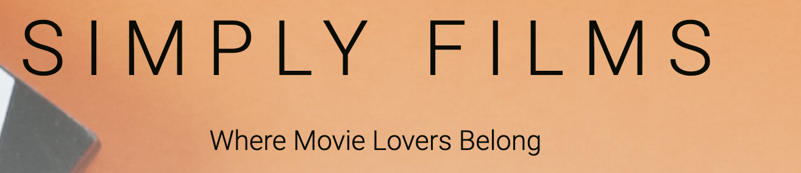

<h1 align="center">

Data Centric Development Milestone Project - Simply Films </h1>

 

Simply Films is a full-stack MongoDB-based Flask project which is to create a database of films that allows users to create, read, update and delete (CRUD) films. Simply Films allows non registered users to browse our database to search for there favourite films. Users are given the opportunity to create an account and benifit from having access to all features of the website. Registered users can add new films, edit and delete there films.

The project was developed using HTML, CSS, JavaScript, and Python, and uses a NoSQL document-based database via MongoDB

 View Deployed site on Heroku here [Simply Films](https://simply-films.herokuapp.com/films)

 **This website is for educational purposes only**

 # Table of Contents
 1. [UX](#ux)
    * [Strategy](#sratergy-plane)
    * [Scope](#scope)
    * [Structure](#structure)
    * [Skeleton](#skeleton-plane)
    * [Surface](#surface-plane)
2. [Features](#features)
3. [Technologies](#technologies-used)
4. [Testing](#testing)
5. [Deployment](#deployment)
6. [Credits](#credits)
7. [Acknowledgements](#acknowledgements)

<h1 align="center">UX</h1> 

# Strategy 

## Research
### What are the most important aspects of movie reccomandation website?
"I would like to navigate with a user-friendly interface and find a certain film" 

"I would like to find a film that has an attractive Image that draws me in"  

"I would like to be able to share my own films to the database" 

### Similar film databases

[IMDB](https://www.imdb.com/s)  

IMDB, in full Internet Movie Database, Web site that provides information about millions of films and television programs as well as their cast and crew. The name is an acronym for Internet Movie Database.

[TMDB](https://www.themoviedb.org/?language=en-GB)  
The Movie Database (TMDb) is a community built movie and TV database. Every piece of data has been added by TMDB community dating back to 2008. The Movie Database Transforms uses the TMDB to search and pivot on movies, talent and directors names.

[Letter Boxed](https://letterboxd.com/)  
Letterboxd is an online social networking service. Letterboxed was launched as a social app focused on sharing opinions about, and love of film. Members can use it as a diary to record their opinions about films, keep track of films they have seen in the past, write reviews or make lists of films and showcase their favorite films

# Business Approach

### Mission Statment
 Help users to find interesting movies easier. Allow the user to search movies by typing in the key word of the movie, Allow the user to search movies by typing desired genre.
 

### Branding
* Branding defines you as your business
* Identify key values
* Consistency
* Clear focus that knows their target audience

### Content
* Simplify existing sites like IMDB
* Clear from the outset
* User Connection
* Intuative Content
* Interactive features 
 
### Aesthetics
* Deliberate use of colours to influence the user experience on a website.
* Make it easy for visitors to find what they are looking for. Multiple tools for accessing information
* keyword-rich content. Use headings and subheadings
* Consistent throughout so that a visitor navigating from page to page will always know where they are and how to get to the next item of interest.
* Elements to be visually connected and balanced

 ## User stories

* `As a visiting user I want to be able to understand the purpose of the website so I can decide if I want to continue navigating`
 
* `As an involved user I want the surface to be simple with an aesthetically pleasing design`

* `"As an unregistered user, I want to be able to view content on the site without having to register, so I can decide whether to make an account."`

* `As an unregistered user, I want to be able to make an account and log in, so that I can benefit from the features of a registered user.`

* `As a logged in user, I want to be able to add content to the database in a simple manner.`

* `As a logged in user, I want to be able to edit or delete content, so that I have control over the content I have stored on the platform.`

* `As a user I want to search movies by typing in the key word of the movie or specific genre`

* `As a mobile user I want to be able to have the same features as the desktop site so I can connect with films on the go`

## opportunities and problems to be solved from user stories
 
|Opportunities | Importance | Viability / Feasibility
|-----|:------:|:-----:|
|**Purpose Of Webpage Explained** | 5 | 5 |
|**Intuitive Design** | 5 | 5 |
|**Clear Instructions** | 5 | 5 |
|**Easy Point Of Contact** | 5 | 3 |
|**Database Access**| 5 | 5 |
|**CRUD Functionality** | 5 | 5 |

## Website Requirements
### Project Goal: 
Provide a platform on which users can add films to a database, allowing them to rate and add useful inforamtion to help other users locate desired films.
#### User Needs:
* To be able to navigate the site with ease.
* To be able to create an account and log in.
* To be able to create, edit, and delete a films to the database.
* To be able to for a film by name or genre.
* To be able to manage films that they have added to the database in an intuative way.

#### Project Objectives:
* To create a film database to help users search for current and past films
* To give the user a sesne of involvment with in a community 
* To allow the user to navigate and control the application with ease on all platforms and devices

# Scope 

## Functional Requiremnts 
### Simple, Intuitive, and Engaging Interface

* Allow a user to navigate, and interact with, the site with ease.
* Take a minimalistic approach to layout, content, and structure, whilst always presenting.
* Ensure the layout and design is responsive to all media sizes.
* Sufficient and relevant information.

### User Managment
* Allow a user to create an account, log in, log out of there account.
* Add data to the database
* Allow user to update, edit and delete data
* Allow user to manage films added to database with ease

## Content Requierments
* Content of the webiste is primaraly generated by users within the database
* When creating an accocunt on simply films users will be advised to 'Add Film' to DB
   * Created By: Backend funcitonaltiy searches user database to allow user to create data
   * Film Name: This will be provided by the user which will be at the base of the film cards
   *  Film Synopsis: Provided by the user, a brief description of the film been added.
   *  Film Genre: A selection of inputs provided to the user to make a choice of what genre of film they are adding to the database.
   * Film Year: Provided by the user to add the year the film was made
   * Film Raiting: This will be set by the user out of 10 
   * Film Actors: Provided by the user, three top lead roles of the film been added
   * Film Image: Prvided by user in URL form which can be done by uploading an image to an external image hosting service.

# Structure 

### The website uses Multiple pages with the content being Powered with Python, NoSQL, Javascript, HTML, CSS as the user navigates through the website.

### Header
The header of the page contains the NavBar and the Logo, It is a static element, and is fixed to the top of the page at all times.

### Navigation
On larger viewports, the navigational elements are separated into separate links within the NavBar. On medium viewports and lower, the navigational elements are collapsed into a SideNav, which can be activated with a toggler in the upper-left corner.

### logo
Logo is placed within the Header element to the left, unless on medium viewports where it is centered.

### Home/ Films/ Login / Register / Logout
Users can access these pages regardless of where they are on the webpage.

### Footer
The footer is positioned at the bottom of the page.this is not a sticky element, and when content exceeds the viewport of the device, the footer is pushed out of the viewport. The footer contains the name of the web page and social links to Github,Facebook,Youtube,Instagram.

### Films
A stylistic design of 8 results per page showing the films avalible for the user to read.

### Film Cards
Details descriptive information of specific film that is extracted from the database for users to read.

## Interactive
### Navbar
The navbar contains four pages for an unregistered user and five for registered users. Each page is highlighted when hoverd over. When viewed in medium to smaller devices a burger icon is active and navigation opens from the side.

### Login/Register/Logout
If a user is not logged in, the NavBar/SideNav provides the relevant Log In/Register links. When a user is logged in, the Logout link replaces the Log In/Register links.

### Add Film
Registered users are shows the 'Add Film' tab when logged in, this is a detailed form which prompts the user to add specific details which is then sent to the database and renders to the films tab if successful.

### Edit Film/Delete
Users that have added data to the database are highlighted with a choice to edit the data of that specific film and also have the option to delete

### Tooltips
Interactive Icons when trying to Add data via the form, gives the user hints to enter the correct inputs when uploading data.

### Modals
Used for defensive programming. Activated when user trys to delete data to confirm that is what they are trying to do.

 
# Skeleton Plane 

### Wireframes

 [Homepage](https://github.com/wilko90/Simply-Scran/blob/master/static/wireframes/homepage-desktop-tablet-mobile.png)

# Surface Plane 

## Brand Image

## Colour Schemes

 

## Images

## Visual Interactions
### navbar
 

### Call To Action Buttons

# Features 

## Existing Features

### Contact 

 
### Favicon Iconfinder

### Modals

### Responsive Design

## Features To Implement

### Food Search Engine

### Registration And Log In 

### Social Platform 

# Technologies Used 

### Languages Used

### Frameworks, Libraries and Programmes

# Testing 

For full testing section [click here](TESTING.md) 

# Deployment 
### How my project was deployed

# Credits 

## Written Content

All content is written by myself.

## Modal Content 

## Images

## Code

# Acknowledgements 

* The Inspiration for this project came from my love of food and drink. I aim to make functionality simple, eye catching design and consistent throughout.

* Thank you to the slack community for guiding me in the right direction.

* Thank you to my girlfriend for supporting me throughout this project. 

* Thank you to the tutors at Code Institute.
 

